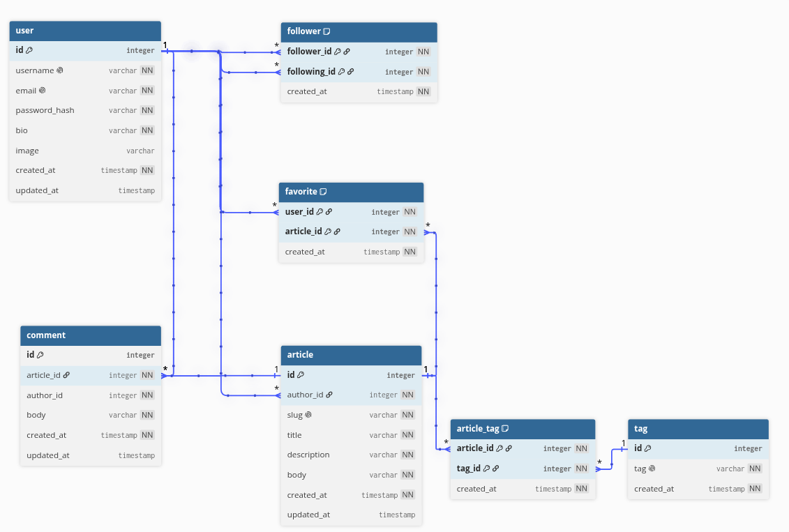

```
Table "user" {
  id integer [pk, increment]
  username varchar [not null, unique]
  email varchar [not null, unique]
  password_hash varchar [not null]
  bio varchar [not null]
  image varchar [null]
  created_at timestamp [not null]
  updated_at timestamp [null]
}

Table follower {
  follower_id integer [not null, ref: > "user".id]
  following_id integer [not null, ref: > "user".id]
  created_at timestamp [not null]

  indexes {
    (follower_id, following_id) [pk]
  }
}


Table article {
  id integer [pk, increment]
  author_id integer [not null, ref: > user.id]
  slug varchar [not null, unique]
  title varchar [not null]
  description varchar [not null]
  body varchar [not null]
  created_at timestamp [not null]
  updated_at timestamp [null]
}


Table tag {
  id integer [pk, increment]
  tag varchar [not null, unique]
  created_at timestamp [not null]
}

Table article_tag {
  article_id integer [not null ]
  tag_id integer [not null, ref: > tag.id]
  created_at timestamp [not null]

  indexes {
    (article_id, tag_id) [pk]
  }
}

Ref: article_tag.article_id > article.id [delete: cascade]


Table favorite {
  user_id integer [not null,ref:> user.id]
  article_id integer [not null]
  created_at timestamp [not null]

  indexes {
    (user_id, article_id) [pk]
  }
}
Ref: favorite.article_id > article.id [delete: cascade]


Table comment {
  id integer [pk, increment]
  article_id integer [not null, ref:>user.id]
  author_id integer [not null]
  body varchar [not null]
  created_at timestamp [not null]
  updated_at timestamp [null]
}

Ref: comment.article_id > article.id [delete: cascade]
```

